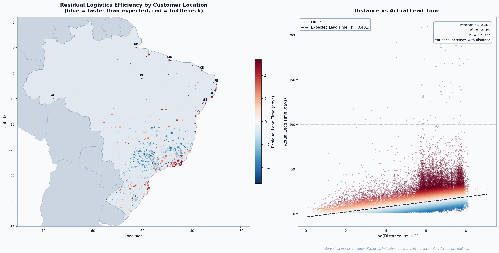
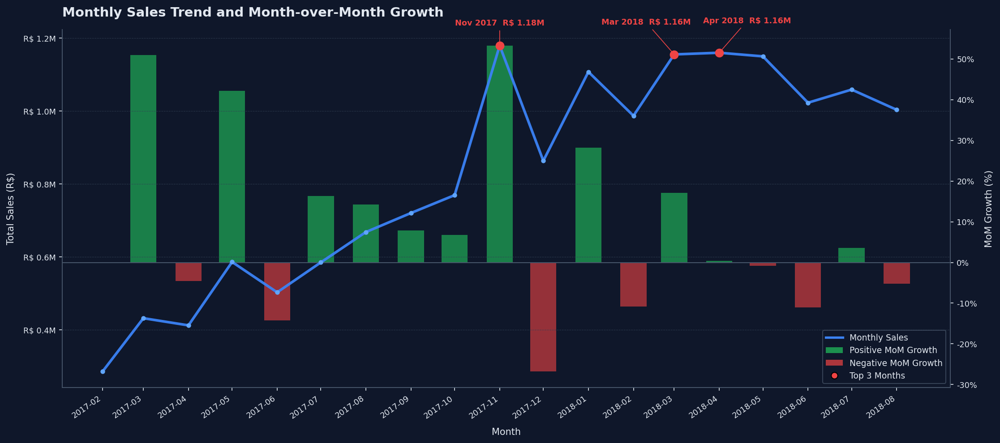
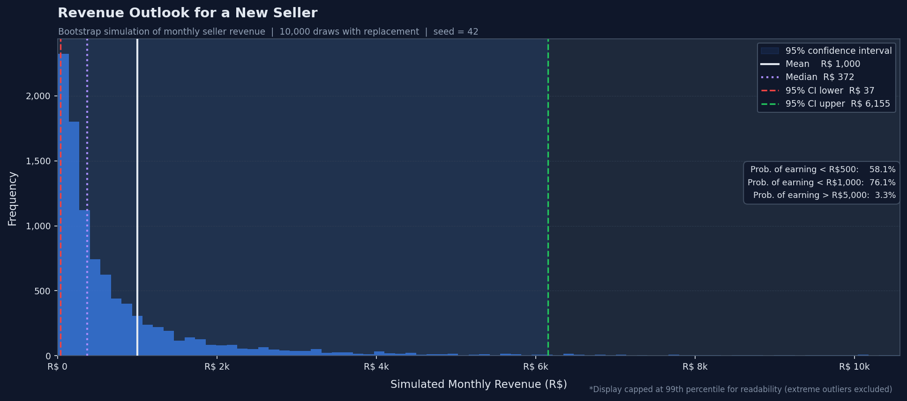
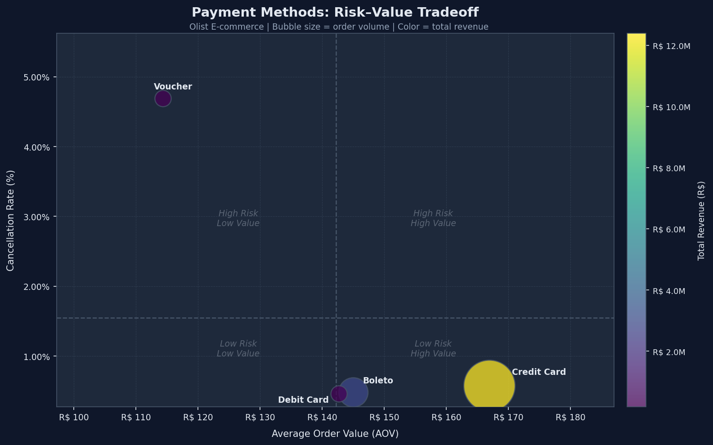

# Brazilian E-Commerce Analytics Project

A multi-question analytical project built on the [Olist Brazilian E-Commerce dataset](https://www.kaggle.com/datasets/olistbr/brazilian-ecommerce) (~100,000 real orders, 2016–2018).  
The project combines **Python, SQL, statistics, and data visualisation** to answer real business questions about logistics, sales trends, seller economics, and payment behaviour.

---

## Analytical Walkthrough

A full walkthrough is available in [`project_walkthrough.ipynb`](project_walkthrough.ipynb), covering the reasoning process, methodology, intermediate interpretation, and final visual outputs for each research question.  
This README is the concise project summary. The notebook is the deeper analytical record.

---

## Research Questions

| # | Question | Method |
|---|----------|--------|
| 1 | **Logistics Efficiency** — Which regions over- or underperform delivery expectations relative to distance? | Log-linear OLS regression · residual analysis · geospatial map |
| 2 | **Sales Trends & Seasonality** — What is the pattern of monthly revenue growth, and where are the seasonal peaks? | SQL window functions (`LAG`, `SUM OVER`) · dual-axis combo chart |
| 3 | **Seller Revenue Uncertainty** — What can a new seller realistically expect to earn per month? | Nonparametric bootstrap simulation (10,000 draws) · probability metrics |
| 4 | **Payment Methods: Risk vs Value** — Do payment methods differ in cancellation risk and average order value? | Risk–value bubble chart (AOV × cancellation rate × volume × revenue) |

---

## Analysis

### Q1 — Logistics Efficiency: Residual Map & Regression

<p align="center">
  <a href="outputs/question_1/geographic_delivery_map_and_regression.png">
    
  </a>
</p>

*Left: Brazil geospatial scatter coloured by mean residual lead time per zip prefix (blue = faster than expected, red = bottleneck). Right: log(distance) vs actual lead time scatter with OLS trendline.*

**Methodology**
- Log-linear OLS regression of actual lead time on `log(distance_km + 1)` — log applied because delivery distance is strongly right-skewed and the marginal effect of each additional km is likely to diminish; `+1` ensures the transformation remains defined for zero or near-zero distances
- Residual = `actual − predicted` days per order; **Mean Residual (days)** by state measures how many days slower or faster deliveries are, on average, than distance alone would predict
- Estimated delivery dates excluded — actual deliveries often arrive before the promised date because the platform appears to use conservative buffers, so `actual − estimated` would mostly capture promise conservatism rather than operational efficiency
- Bottleneck states evaluated using two transparent metrics: **mean residual** for delay severity per order, and **total orders** for the number of deliveries affected
#### Finding
Distance explains ~16% of lead-time variance (R² = 0.160, r = 0.401, n = 95,977). The remaining 84% is operational — residual clusters expose where carrier quality, fulfillment density, and infrastructure are the binding constraint.

#### Recommendation
**SE, CE, MA, and PA** have the highest per-order delays (+3–5 days beyond what distance predicts) and are the strongest targets for regional infrastructure investigation. **RJ** has a lower per-order residual (+1.96 days) but the largest affected volume among bottleneck states (~9,000 orders), making it the highest-priority candidate for a carrier or fulfillment review where any improvement returns at scale. **SP, MG, PR, and DF** consistently undercut predicted lead times and serve as the operational benchmark for underperforming states.

---

### Q2 — Sales Trends & Month-over-Month Growth

<p align="center">
  <a href="outputs/question_2/sales_trend.png">
    
  </a>
</p>

*Dual-axis chart: total monthly sales line (left axis) with month-over-month growth rate bars (right axis). Top-3 peak months annotated.*

**Methodology**
- Revenue aggregated monthly via SQL `JOIN` across `orders` and `order_items`; analysis restricted to Jan 2017 – Aug 2018 (the stable, fully-covered data window)
- Early months and the final incomplete month excluded — sparse initial order volumes produce extreme MoM swings that misrepresent trend; the chart reflects the stable growth window only
- Month-over-month growth computed using `LAG()` window function in a single SQL query pass — no Python post-processing
- Dual-axis combo chart chosen to show absolute scale and growth rate simultaneously without a separate panel

#### Finding
Sales grew strongly from early 2017 through mid-2018 with clear seasonal concentration. The top three months by revenue represent a disproportionate share of total annual sales.

#### Recommendation
November 2017, March 2018, and April 2018 were the three highest-revenue months in the analysis window — plan inventory, logistics capacity, and staffing specifically around those peaks. Flat or declining MoM growth outside seasonal periods warrants demand-side investigation.

---

### Q3 — Seller Revenue Outlook (Bootstrap Simulation)

<p align="center">
  <a href="outputs/question_3/bootstrap_sim.png">
    
  </a>
</p>

*10,000-draw bootstrap simulation of monthly seller revenue. Shows mean, median, and 95% CI.*

**Methodology**
- Empirical distribution: one revenue observation per `(seller_id, calendar month)` pair — no parametric shape assumed
- Bootstrap simulation: 10,000 draws with replacement from the empirical population using `np.random.default_rng(seed=42)`
- Median reported as the primary benchmark — seller revenue is strongly right-skewed, making the mean a misleading guide for new sellers
- Probability metrics (P < R$500, P > R$5,000) give decision-relevant framing rather than a single point estimate

#### Finding
The median seller earns BRL 372/month — far below the mean of BRL 1,000, which is pulled up by a small number of high earners. 58.1% of seller-months fall below BRL 500; only 3.3% exceed BRL 5,000. The 95% CI (BRL 37–6,155) spans more than 100×, reflecting genuine market variability.

#### Recommendation
Quote median revenue (BRL 372) and concrete thresholds — 58.1% of months earn below BRL 500, 76.1% below BRL 1,000, only 3.3% above BRL 5,000 — in seller onboarding materials rather than the mean. Consider support programmes for bottom-quartile sellers, where earnings volatility is highest.

---

### Q4 — Payment Methods: Risk–Value Tradeoff

<p align="center">
  <a href="outputs/question_4/risk_matrix.png">
    
  </a>
</p>

*Bubble chart: X = average order value, Y = cancellation rate, size = order volume, colour = total revenue (viridis). Quadrant lines at cross-method mean AOV and mean cancellation rate.*

**Methodology**
- Orders with multiple payment types excluded — single-type orders only, for clean unambiguous attribution per method
- Cancellation defined as `order_status = 'canceled'` only; `unavailable` excluded because it likely reflects fulfillment/inventory issues rather than payment-related behaviour
- Four dimensions encoded in one chart: AOV (x), cancellation rate (y), order volume (bubble size), total revenue (colour) — avoids separate tables and makes the risk–value tradeoff immediately visible

#### Finding
Voucher's 4.7% cancellation rate is roughly 8× higher than credit card (0.57%), boleto (0.48%), and debit card (0.46%), while producing the lowest average order value. Credit card dominates on order volume and total revenue with a comparatively low cancellation rate, placing it squarely in the Low Risk / High Value quadrant.

#### Recommendation
Voucher warrants the most immediate attention — highest cancellation rate (4.7%) combined with the lowest AOV means it carries risk without a revenue premium to offset it. Focus cancellation-reduction efforts there first. Credit card's Low Risk / High Value position requires no intervention — maintain it as the baseline. Boleto's low cancellation rate and moderate volume make it a viable target for AOV-growth incentives.

---

## Key Insights & Business Recommendations

| Question | Core Finding | Recommended Action |
|---|---|---|
| **Logistics** | Geography explains only 16% of lead-time variance. SE, CE, MA, PA have the highest per-order delays (+3–5 days); RJ has the largest affected volume (~9,000 orders) at +1.96 days. | Prioritise RJ for carrier/fulfillment review (scale); investigate SE/CE/PA/MA as regional infrastructure targets; use SP/MG/PR/DF as benchmarks. |
| **Sales** | Strong growth Jan 2017–Aug 2018; peak revenue in November 2017, April 2018, and March 2018. | Plan capacity and staffing around those three months; use MoM trend as a leading platform health indicator. |
| **Seller Revenue** | Median BRL 372/month vs mean BRL 1,000. 58.1% of seller-months below BRL 500; only 3.3% above BRL 5,000. | Quote median and concrete probability thresholds in onboarding — not the mean. Target support at bottom-quartile sellers. |
| **Payments** | Voucher cancellation rate 4.7% — roughly 8× credit card (0.57%). Credit card dominates volume and revenue in the Low Risk / High Value quadrant. | Prioritise voucher cancellation reduction; protect credit card position; use boleto's low-risk profile for AOV-growth incentives. |

---

## Tools & Libraries

| Tool | Purpose |
|------|---------|
| Python 3.10+ | Core language |
| SQLite + sqlite3 | Local relational database — no server required |
| Pandas | Data manipulation and SQL result handling |
| NumPy | Vectorised computation, bootstrap sampling, statistics |
| Matplotlib | All four output charts |
| SciPy | Pearson correlation for regression fit and residual diagnostics (Q1) |
| GeoPandas | Brazil map background for the geospatial scatter plot (Q1) |

---

## Project Structure

```
project_root/
├── main.py                   # CLI entry point — runs any or all questions
├── README.md
├── requirements.txt
├── project_walkthrough.ipynb # Full analytical walkthrough
│
├── src/
│   ├── db_setup.py           # Loads CSVs into SQLite; exposes query() helper
│   ├── question1.py          # Logistics efficiency & residual analysis
│   ├── question2.py          # Sales trends & seasonality
│   ├── question3.py          # Seller revenue bootstrap simulation
│   └── question4.py          # Payment methods risk–value analysis
│
├── data/                     # Raw CSV files (not committed to Git)
├── outputs/                  # Generated charts per question
│   ├── question_1/
│   ├── question_2/
│   ├── question_3/
│   └── question_4/
│
└── docs/
    └── codebase_guide.md     # Architecture and code walkthrough
```

---

## How to Run

```bash
# 1. Install dependencies
pip install -r requirements.txt

# 2. Build the SQLite database (first time only — reads all 9 CSVs)
python -m src.db_setup

# 3. Run the full analysis suite
python main.py

# 4. Run a single question
python main.py --question 2
python -m src.question3
```

Charts are saved to `outputs/question_N/`.

---

## Data Source & License

**Dataset:** [Brazilian E-Commerce Public Dataset by Olist](https://www.kaggle.com/datasets/olistbr/brazilian-ecommerce)  
**Source:** Olist, via Kaggle  
**Dataset license:** [CC BY-NC-SA 4.0](https://creativecommons.org/licenses/by-nc-sa/4.0/) — the raw data is © Olist and remains under its original license.

This repository contains only code, analysis, a notebook, and static chart outputs. **Raw CSV files are not redistributed** — they are excluded from version control (see `.gitignore`). To reproduce the analysis, download the 9 CSV files from Kaggle and place them in the `data/` folder before running `src/db_setup.py`.

**This repository's code and documentation** are released under the [MIT License](LICENSE).
